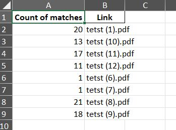
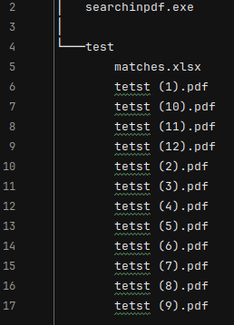

# textsearchinPDF
OS:       Windows 11  
Use:      opens console to 1. enter path and 2. textstring to search for.  
Purpose:  search in all PDF files within specified path and all subdirectories.  
Output:   Console shows file name, page numbers of the matches and total number of matches.  
Output:   Excel file 'matches.xlsx' with the number of matches and hyperlinks to respective files.  

Enter path in console  
  

Enter search string in console  
  

See results in console with:  
no. of files found to search in  
path, file, page no. for each match  
total match count  
  

Press 'enter' to start Excel or Crtl+c to abort  
  

Result example in Excel  
  

File structure for for screenshot example:  
  

